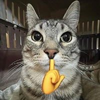
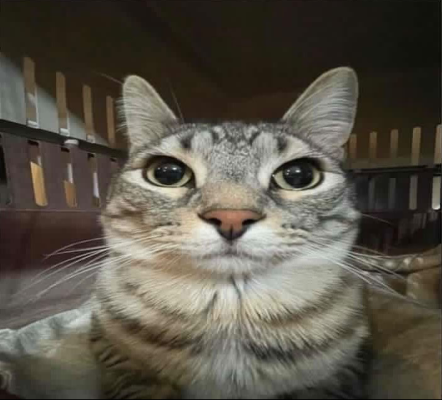

# Cat Meme Detector

웹캠이나 사진에서 사람의 표정과 손동작을 인식하고, 가장 잘 어울리는 고양이 밈을 찾아 보여 주는 Windows용 C++17 애플리케이션입니다.

OpenCV 5.0을 기반으로 얼굴 검출, 표정 분류, 손바닥 검출, 21개 손 관절 추정을 수행합니다. 결과 화면에는 입력 영상과 선택된 밈, 유사도, 표정, 손동작, DNN 백엔드가 함께 표시되며 GIF 밈은 애니메이션으로 재생됩니다.

<p align="center">
  
  
  
  
  
  
</p>

## 주요 기능

- 웹캠 실시간 분석 및 단일 이미지 분석
- 7가지 표정 인식: `angry`, `disgust`, `fearful`, `happy`, `neutral`, `sad`, `surprised`
- 6가지 손동작 분류: `fist`, `open-palm`, `peace`, `pointing`, `thumbs-up`, `other`
- JPG, JPEG, PNG, WEBP, BMP, GIF 밈 지원
- CSV 라벨 우선 적용 및 라벨이 없는 밈의 자동 분석
- CPU 실행과 CUDA FP16 가속 지원
- 에셋 복사, 모델 추론, 매칭 로직을 검사하는 회귀 테스트 포함

## 동작 방식

1. Haar Cascade가 입력에서 가장 큰 사람 얼굴을 찾습니다.
2. MobileFaceNet 모델이 얼굴 표정을 분류합니다.
3. MediaPipe 모델이 손바닥을 검출하고 21개 손 관절을 추정합니다.
4. 입력과 각 밈의 표정, 손동작, 시각 특징을 점수화해 가장 가까운 밈을 선택합니다.

손이 없을 때는 표정 85%와 시각 특징 15%를 사용합니다. 손이 있을 때는 표정 45%, 손동작 45%, 시각 특징 10%를 사용합니다. 손이 감지되지 않았고 `none` 라벨의 밈이 있으면 손동작 밈은 후보에서 제외됩니다.

웹캠 분석은 5프레임마다 수행됩니다. 같은 손동작이 4회 연속 관측되어야 매칭에 반영되고, 활성화된 손동작은 손을 2회 연속 놓쳤을 때 해제됩니다. 얼굴이 검출되면 임계값보다 점수가 낮아도 가장 가까운 결과를 `CLOSEST`로 표시하며, 임계값 이상인 결과는 `MATCH`로 표시합니다.

## 요구 사항

- Windows 10 또는 11, x64
- Visual Studio 2022 또는 Build Tools의 **Desktop development with C++** 워크로드
- CMake 3.20 이상
- Git과 인터넷 연결: 첫 빌드에서 OpenCV 및 opencv_contrib 5.0.0 다운로드
- Ninja: PATH에 설치되어 있지 않으면 Visual Studio에 포함된 실행 파일 사용
- 웹캠 모드 사용 시 카메라

모델과 기본 밈은 저장소의 `assets` 디렉터리에 포함되어 있어 별도로 받을 필요가 없습니다.

## 빠른 시작

저장소 루트의 PowerShell에서 실행합니다.

```powershell
Set-ExecutionPolicy -Scope Process Bypass
.\scripts\build.ps1
.\build-opencv5\cat_meme_detector.exe
```

첫 실행은 OpenCV를 소스에서 정적으로 빌드하므로 시간이 걸릴 수 있습니다. 빌드 스크립트는 다음 작업을 한 번에 수행합니다.

- OpenCV와 opencv_contrib 5.0.0 다운로드
- 필요한 OpenCV 모듈 빌드 및 설치
- Cat Meme Detector 빌드
- `assets`를 실행 파일 옆에 동기화
- CTest 회귀 테스트 실행

결과 실행 파일은 `build-opencv5/cat_meme_detector.exe`입니다.

### 릴리즈 패키지 만들기

CPU용 Release 빌드를 테스트한 뒤, 실행에 필요한 에셋과 DLL을 포함한 배포 폴더와 ZIP을 생성합니다.

```powershell
.\scripts\release.ps1
```

기본 산출물은 `out/cat-meme-detector-v1.0.0-windows-x64/`와 같은 이름의 `.zip`, `.zip.sha256` 파일입니다. 버전은 `CMakeLists.txt`에서 자동으로 읽습니다.

```powershell
# 기존 OpenCV 빌드를 재사용
.\scripts\release.ps1 -SkipOpenCVBuild

# 버전과 출력 디렉터리 지정
.\scripts\release.ps1 -Version 1.0.1 -OutputDirectory artifacts
```

패키지에는 `cat_meme_detector.exe`, 작성된 `assets` 계층, OpenCV FFmpeg 플러그인, x64 Visual C++ 런타임 DLL, README와 서드파티 고지가 포함됩니다. ZIP 생성 전에 패키지의 모든 에셋을 원본과 대조하고 패키징된 실행 파일로 `--check-assets`를 실행합니다.

### 빌드 옵션

```powershell
# Debug 빌드
.\scripts\build.ps1 -Configuration Debug

# 이미 빌드한 OpenCV 재사용
.\scripts\build.ps1 -SkipOpenCVBuild

# OpenCV를 다시 구성하고 빌드
.\scripts\build.ps1 -ReconfigureOpenCV
```

## CUDA 빌드

CUDA 구성은 CPU 빌드와 분리된 `build-opencv5-cuda` 및 `.deps/opencv-install-cuda`에 생성됩니다. 현재 빌드 스크립트는 RTX 50 시리즈용 compute capability 12.0(`sm_120`)을 대상으로 합니다.

CUDA Toolkit 13.x와 cuDNN 9를 설치한 뒤 새 PowerShell에서 실행합니다. cuDNN이 기본 경로에 없다면 `CUDNN_ROOT`를 지정합니다.

```powershell
$env:CUDNN_ROOT = 'C:\path\to\cudnn'
.\scripts\build.ps1 -EnableCuda
.\build-opencv5-cuda\cat_meme_detector.exe
```

애플리케이션은 CUDA FP16을 우선 사용하고, CUDA 초기화나 추론에 실패하면 CPU로 자동 전환합니다. 현재 백엔드는 콘솔, 결과 창, 실행 파일 옆의 `cat_meme_detector.log`에서 확인할 수 있습니다. CUDA 빌드에서도 `--cpu`를 주면 CPU만 사용합니다.

## 실행 옵션

```text
cat_meme_detector.exe [options]

--camera N       사용할 웹캠 번호 (기본값: 0)
--memes PATH     밈 이미지 디렉터리
--cascade PATH   사람 얼굴 검출용 Haar Cascade XML
--threshold N    MATCH 표시 기준, 0~100 (기본값: 40)
--image PATH     웹캠 대신 이미지 한 장 분석
--check-assets   밈 에셋을 인덱싱한 뒤 종료
--cpu            CUDA를 끄고 CPU DNN 사용
--help, -h       도움말 표시
```

사용 예:

```powershell
# 두 번째 웹캠 사용
.\build-opencv5\cat_meme_detector.exe --camera 1

# 사진 한 장 분석
.\build-opencv5\cat_meme_detector.exe --image .\portrait.jpg

# 별도 밈 폴더와 더 높은 임계값 사용
.\build-opencv5\cat_meme_detector.exe --memes D:\memes --threshold 60

# 배포된 에셋을 읽을 수 있는지 빠르게 검사
.\build-opencv5\cat_meme_detector.exe --check-assets
```

웹캠 모드에서 `Q` 또는 `Esc`로 종료하고, `R`로 밈 디렉터리를 다시 읽습니다. 단일 이미지 모드는 아무 키나 누르면 종료됩니다.

## 밈 추가하기

1. 이미지를 `assets/memes` 아래에 추가합니다.
2. 자동 분석 결과를 보정하려면 `assets/meme_labels.csv`에 라벨을 추가합니다.
3. 다시 빌드하거나, 실행 파일 옆의 `assets`를 직접 수정했다면 실행 중 `R`을 누릅니다.

CSV 형식은 다음과 같습니다.

```csv
# filename,expression,gesture
my_meme.gif,happy,thumbs-up
```

`expression`에는 7가지 표정 이름 또는 `unknown`을 사용할 수 있습니다. `gesture`에는 `none`, `fist`, `open-palm`, `peace`, `pointing`, `thumbs-up`, `other`를 사용할 수 있습니다.

CSV에 작성한 값은 자동 분석보다 우선합니다. 특히 `none`은 해당 밈에 손동작이 없다는 명시적 라벨로 유지됩니다. 파일명은 밈 파일의 이름과 확장자를 포함해 정확히 일치해야 합니다.

## 테스트

`scripts/build.ps1`은 빌드가 끝나면 테스트를 자동 실행합니다. 기존 빌드에서 테스트만 다시 실행하려면 다음 명령을 사용합니다.

```powershell
ctest --test-dir .\build-opencv5 -C Release --output-on-failure
```

테스트는 다음 항목을 포함합니다.

- 작성된 모델 및 밈 계층의 존재와 빌드 결과물 동기화
- 시각 특징 비교와 표정·손동작 가중치
- 손동작 안정화 및 CPU DNN 추론
- 지원 이미지와 GIF 디코딩
- 라벨 우선순위와 라벨 없는 밈의 자동 분석
- 런타임이 숨겨진 대체 이미지를 생성하지 않는지 확인

## 프로젝트 구조

```text
assets/
  memes/                 기본 밈 이미지
  models/                얼굴·표정·손 검출 모델
  meme_labels.csv        밈별 표정·손동작 라벨
include/cat_meme/        공개 C++ 헤더
src/                     애플리케이션 및 매칭 구현
tests/                   회귀 테스트와 테스트 데이터
scripts/build.ps1        Windows 빌드 자동화
scripts/release.ps1      CPU 릴리즈 패키지 및 체크섬 생성
patches/                 OpenCV 5.0 빌드 호환 패치
```

## 문제 해결

- 웹캠을 열 수 없으면 다른 프로그램이 카메라를 사용 중인지 확인하고 `--camera 1`처럼 장치 번호를 바꿔 보세요.
- `Visual Studio C++ Build Tools were not found` 오류가 나면 Visual Studio Installer에서 C++ 데스크톱 개발 워크로드를 설치하세요.
- Ninja를 찾지 못하면 `winget install Ninja-build.Ninja`로 설치한 뒤 새 PowerShell을 여세요.
- CUDA 빌드에서 cuDNN을 찾지 못하면 `CUDNN_ROOT`가 `cudnn_version.h`와 `cudnn.lib`가 들어 있는 설치 트리를 가리키는지 확인하세요.
- 실행 중 상세 기록은 실행 파일과 같은 디렉터리의 `cat_meme_detector.log`에서 확인할 수 있습니다.

## 서드파티 자료

OpenCV 및 포함된 모델·테스트 자료의 출처와 라이선스는 [THIRD_PARTY_NOTICES.md](THIRD_PARTY_NOTICES.md)를 참고하세요. `assets/memes`의 이미지는 저장소 소유자가 제공했으며 프로젝트 소스 코드의 라이선스 범위에 포함되지 않습니다.
